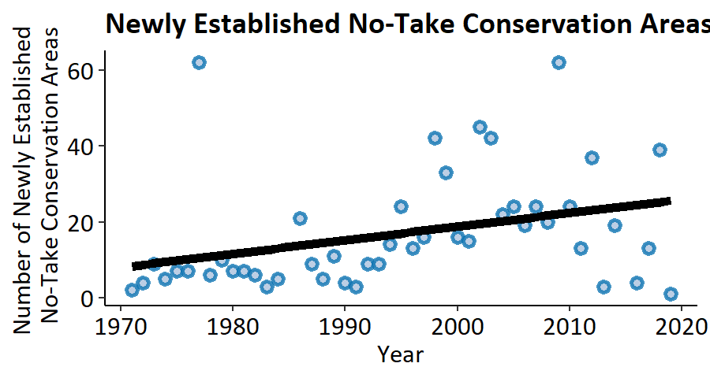
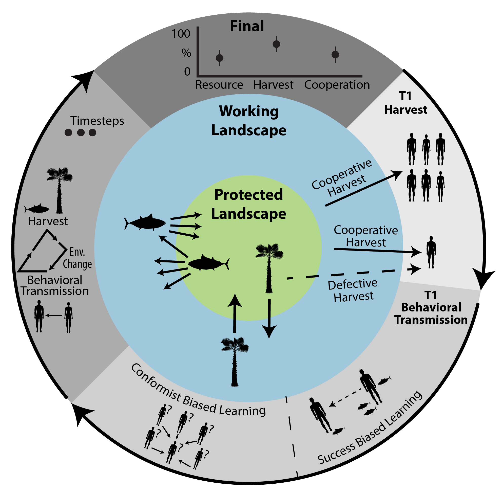
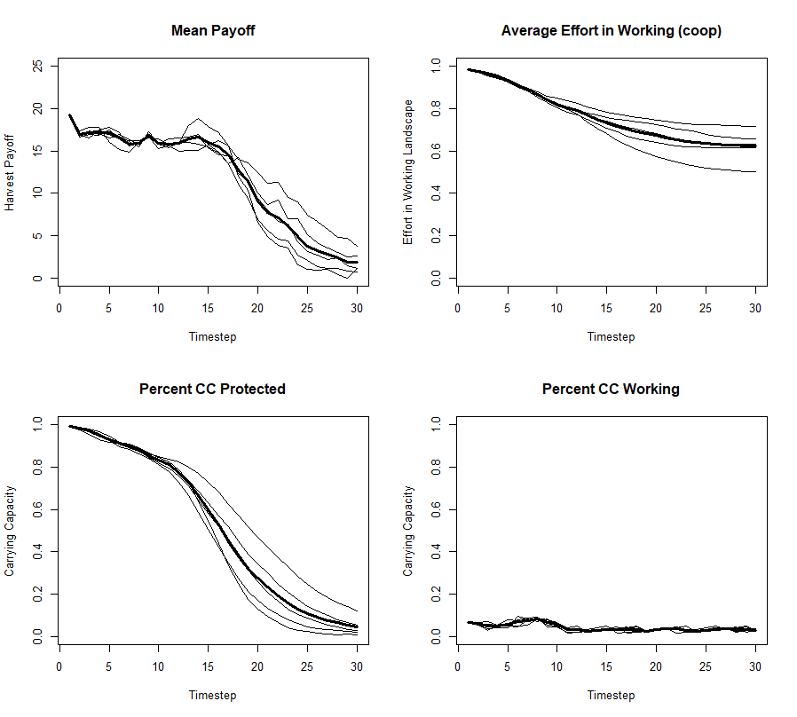
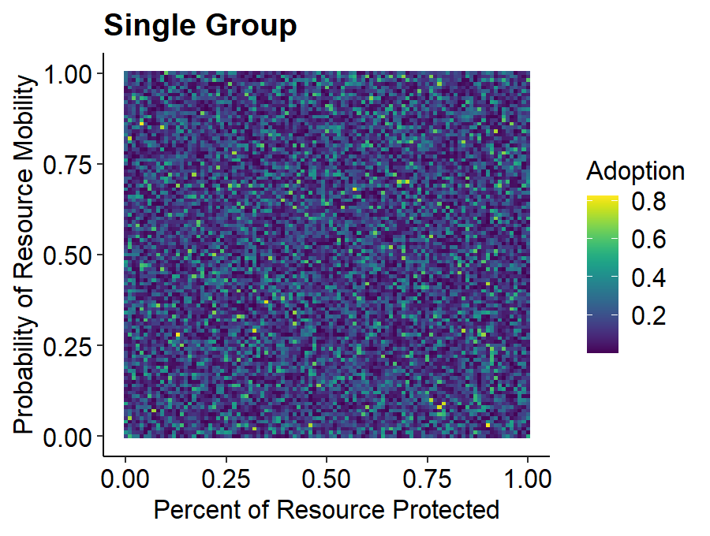
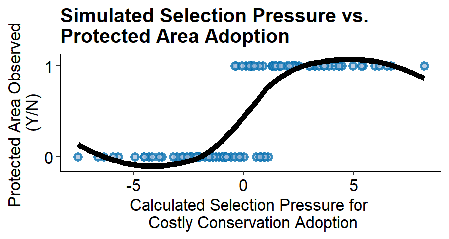
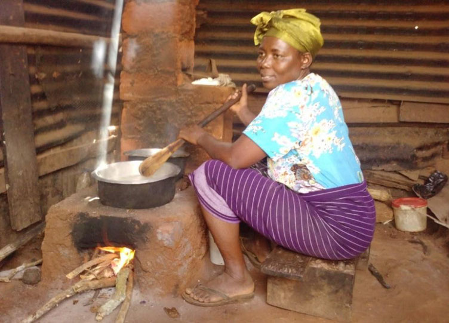
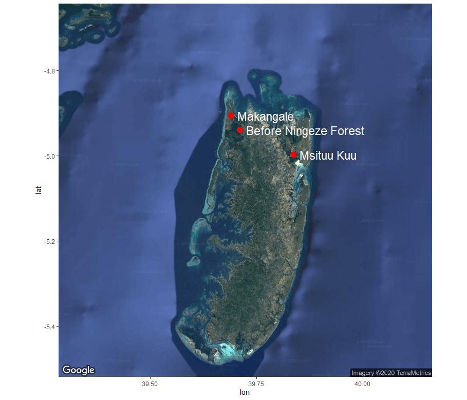
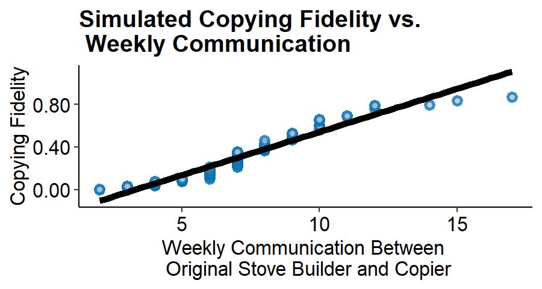
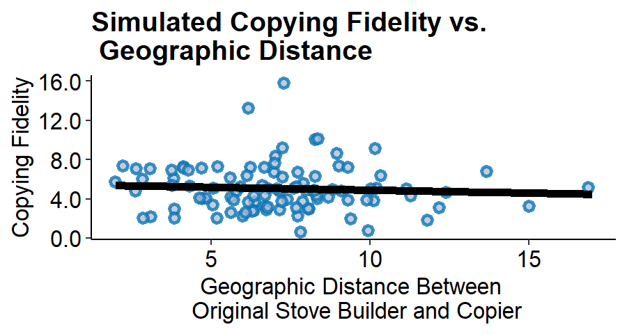

--- 
title: Cultural Evolution of Conservation Behavior at the Intersection of Working
  Landscapes and Protected Areas
author: "Matt Clark"
date: "`r Sys.Date()`"
output:
  bookdown::pdf_document2:
    toc: yes
  pdf_document:
    toc: yes
    extra_dependencies: "subfig"
  bookdown::html_document2:
    toc: yes
fontsize: 12pt
link-citations: yes
csl: AmJBot.csl
subtitle: Dissertation Proposal for Committee Review
bibliography: [References/Dissertationproposal.bib,References/NonZoteroRefs.bib]
---
```{r packages, include=FALSE, cache=FALSE, message=FALSE, warning=FALSE}
library(knitr)
library(rmarkdown)
library(bookdown)
library(formattable)
library(kableExtra)
library(dplyr)
library(magrittr)
library(prettydoc)
library(htmltools)
library(knitcitations)
library(devtools)
library(tidyverse)
library(scales)
library(extrafont)

```

```{r setup, include=FALSE, cache=TRUE, message = FALSE, warning=FALSE}
# Chunk options: see http://yihui.name/knitr/options/ ###

## Text results
#opts_chunk$set(echo = TRUE, warning = TRUE, message = TRUE, include = TRUE)

## Code decoration
#opts_chunk$set(tidy = TRUE, tidy.opts = list(blank = FALSE, width.cutoff = 60), highlight = TRUE)

## Caching code
knitr::opts_chunk$set(cache = 2, cache.path = "Cache/")

## Plots
#opts_chunk$set(fig.path = "Figures_MS/", dev=c('pdf', 'png'), dpi = 300)

## Locate figures as close as possible to requested position (=code)
knitr::opts_chunk$set(fig.pos = 'H')
```

# Summary
Area-based conservation is critical for stemming global biodiversity loss. As such, each year billions of dollars are spent to protect key areas. It is common, however, for these areas to fail to reach their stated conservation goals. The most chronic causes of conservation project failure are the human dimensions. Conversely, historic conservation successes are also attributed to widespread human adoption of conservation behaviors. Research examining how and why conservation practices are adopted tends to suffer from a bias toward the reporting of successful projects and highly context dependent drivers and outcomes. This dissertation seeks to demonstrate and better understand the underlying mechanisms which underpin social adoption of conservation practices in and around protected areas. Toward this aim, this project will combine insights from cultural group selection theory with empirical research on Pemba Island, Tanzania to achieve three primary objectives. 

1. Develop a dynamic model to generate predictions regarding if and how conservation norms can emerge and persist via competition between groups.

2. Empirically test theoretical predictions of group conservation adoption as a function of group competition and individual costs and benefits.

3. Using the ongoing spread of an improved efficiency cookstove design, specifically examine how the nature of interpersonal relationships may modify conservation behaviors as they spread within groups. 

Globally, we have expended a tremendous amount of resources to identify conservation goals which will deliver the greatest benefits to biodiversity and ecosystem function. For these benefits to come to fruition however, conservation initiatives must be adopted at a rate which exceeds ecological degradation. This research will bring together cultural evolutionary science and ecology to identify the key mechanisms of conservation adoption.  

# Introduction
## Phenomenon
Human prosperity is unequivocally linked to the persistence of diverse, self-sustaining ecosystems through our dependence on ecosystem services and consumption of renewable resources. Until approximately 50 years ago, the rate of overall ecological regeneration exceeded our rates of consumption and destruction of earth’s renewable resources [@network2019global]. Today, on average, we degenerate these resources at a rate 56% faster than regeneration [@network2020global]. This is particularly concerning as renewable resources regenerate at a rate proportional to the resource stock remaining [@beltratti_sustainable_1993]. Thus, overuse of earth’s renewable resources creates a positive feedback loop where scarcity slows regeneration and further perpetuates scarcity [@regev_biological_1998]. 

The capacity of an ecosystem to provision renewable resources largely hinges on an area’s biodiversity [@haines2010links; @redford1995human]. As such, biodiversity is the key metric used to determine the integrity of an ecosystem and a key conservation target [@parrish_are_2003]. Each year, an ever growing proportion of earth’s marine and terrestrial areas are sectioned off to protect local biodiversity (hotspots), the flow of genetic diversity across a landscape (corridors), and human access to renewable resources (forest concessions, fisheries, etc.) (Figure \@ref(fig:paNumber)) [@iucn2020protectedplanet]. These area-based conservation initiatives are from hereon referred to as protected areas. 

```{r paNumber, echo=FALSE, fig.cap="Number of newly established no-take protected areas reported by the IUCN 2020", out.width = "100%", fig.align='center', dpi=72, fig.pos= "H"}

```

Protected areas have proven to be a powerful tool for sustaining biodiversity and ecosystem function at a landscape scale while also ensuring continued access to renewable resources for local communities [@adams_biodiversity_2004; @leverington_global_2010]. While high-profile protected area successes are salient in the conservation narrative, protected areas also commonly fail to reach their intended biodiversity targets. The ubiquity of these failures is somewhat speculative as unsuccessful protected areas go largely unreported [@bottrill_pursuit_2011; @sutherland_need_2004]. Regardless of the high degree of uncertainty in the prevalence of protected area failures, the cause is more often than not a lack of social buy-in and adherence to protected area regulations [@catalano_learning_2019].

Community norms around protected area adherence are characterized as individually costly, yet beneficial at the group level. Substantial variation exists in the degree to which communities adhere to protected area regulations; some communities develop strong and lasting conservation norms, while in others these norms degrade over time or may fail to emerge at all [@rogers_diffusion_2010; @simon_win-win_2012]. Given that the human dimensions are most often the crux of successful conservation, the field of conservation social science has been developed to better understand which social factors are pertinent to conservation success [@bennett_conservation_2017]. This body of work has shown that where group norms around the adoption of protected areas have emerged, they persist via group conformity, especially where clear group identities are present [@ostrom_governing_1990; @richerson2001evolution]. What is less understood however, is the emergence and initial adoption of conservation behaviors. 

Research on the diffusion of conservation behaviors suffers from a lack of generalizability. Case studies tend to be highly context dependent and offer little mechanistic insight into the emergence and spread of these behaviors. Outside of conservation science, the field of evolutionary anthropology has devoted considerable effort to understanding how and why individuals adopt costly cooperative behaviors. Of particular relevance to understanding group adherence to protected area regulations, the theory of cultural group selection offers a mechanistic explanation for the emergence and spread of individually costly group norms.  

## Primer on cultural group selection
The largely untested theory of cultural group selection poses a mechanism for the emergence and spread of individually costly yet group beneficial behaviors such as warfare or religious donations [@boyd_transmission_2010]. Cultural group selection suggests that groups who develop individually costly yet group beneficial norms will outcompete groups who do not. As an individual’s behavior is flexible, individuals will either migrate from less to more successful groups or directly copy the cooperative behavior of others in visibly successful cooperative groups [@henrich_cultural_2004]. This change in the frequency of behavioral traits is analogous to the perpetuation of beneficial alleles in genetic natural selection. In these contexts, selective pressures still push individuals towards selfish behaviors like freeriding, but cooperative norms will emerge if group selection pressures outweigh those of individual selection overall [@mcelreath_mathematical_2008; @okasha_multilevel_2004; @price1972extension]. 

Existing cultural group selection theory is highly abstract, relying on simple, analytical models of nonspecific behaviors [@boyd_rapid_2011; @lehmann_cultural_2008]. Current theory therefore does not offer predictions about the emergence and adoption of conservation norms specifically. Conservation behaviors are fundamentally different from generic cooperative behaviors as they operate under the sink/source dynamics of renewable, mobile resources as well as variable resource regeneration rates. As such, cultural group selection theory must be extended to include these dynamics in order to be effectively applied to conservation. 

## Applying cultural group selection to the adoption of conservation behaviors
Protected areas are an ideal microcosm for studying and applying cultural group selection. Protected areas have the potential to support resource sustainability and local livelihoods at the group level, but require costly cooperation from individuals [@adams_biodiversity_2004]. While this tradeoff is straightforward in theory, the social and ecological outcomes of protected area establishment vary significantly in practice [@naughton-treves_role_2005]. Agrawal and Redford [-@agrawal2006poverty] argue that this is because protected areas are often created as “a shot in the dark,” with little attention paid to the mechanisms which cause protected areas to be widely adopted and subsequently successful. Under cultural group selection theory, we expect that the key mechanism which drives the adoption of protected areas is the balance between the individual and group level selection pressures for cooperation or defection. Therefore, not only do protected areas represent a system where cultural group selection theory can be studied empirically, but principles of cultural group selection may also provide a way forward for predicting and shaping the success of protected areas on the ground. 

## Fidelity of behavioral transmission
The final component of behavioral adoption that is necessary to understand and shape effective conservation is the fidelity of behavioral transmission. In situations where behaviors do emerge and spread within a population, as the behavior is transmitted along the chain of individuals, it may be modified considerably to the point where the behavioral outcome is unrecognizable [@lewis_transmission_2012; @mcguigan_over-imitation_2011]. This phenomenon is of particular interest to conservation science where the outcomes of behavioral adoption are of greater interest than the behaviors themselves. Theoretical insights and controlled empirical research on transmission fidelity suggests that behavioral outcomes are more likely to be retained during transmission when the copying individual has greater access to the demonstrator [@king2007use; @muthukrishna_when_2016]. These insights are crucial for practitioners aiming to implement long-lasting, effective conservation projects, but must first be tested empirically in a conservation context where an individual’s access to a behavioral demonstration is realistic and outcomes of adopted behaviors have real impacts for individuals, communities, and the environment.

## Dissertation objectives
The overarching question this research seeks to answer is: What are the underlying social mechanisms which cause conservation behaviors to emerge and spread efficiently within populations?
 
* Objective 1: Create a dynamic, agent-based model which extends theories of cultural group selection into the contexts of conservation. Formally test the intuition that between group imitation can lead to the spread of community wide protected area adoption whereas solitary groups may fail to cooperate under identical environmental constraints such as resource degradation, regeneration, and mobility.

* Objective 2: Calculate theoretical adoption probabilities of protected areas known as Community Forest Management Agreements (CoFMAs) for each ward on Pemba Island, Tanzania. Probabilities are based on the salience of group cultural identities and the costs and benefits of CoFMAs to individuals and groups. Compare theoretical predictions to the presence or absence of CoFMAs in reality.  

* Objective 3: Quantitatively examine how social and physical access to a behavioral demonstration during behavioral transmission affects both the copying fidelity as well as the performance of copied behavior. This project will make use of the ongoing spread of fuel efficient cookstove technology on Pemba Island, Tanzania.

# Chapter 1: Theoretical Advances for Applying Cultural Group Selection Theory to Area-Based Conservation. 
## Background
Cultural group selection theorizes that individuals will adopt cooperative behavior if the group benefits of doing so allow their cultural group to outcompete other groups [@rindos_darwinian_1985]. Under this framework, the presence of multiple competing groups drives community cooperative norms to emerge under a much broader set of conditions compared to solitary groups [@richerson_cultural_2016]. Protected area conservation is a cooperative phenomenon where individuals sacrifice some degree of their own harvest potential in order to benefit the group as a whole. Therefore, insights from cultural group selection may help conservation scientists better understand and predict community adherence to protected area regulations [@brooks_applying_2018]. 

While cultural group selection theory offers mechanistic insights for the emergence of cooperative norms in groups broadly, its applicability to conservation specifically is unknown. Conservation has many aspects which make it unique compared to cooperation in the abstract. In conservation, an individual’s behavior directly affects their environment, which may in turn become altered in a way which shapes future individual decision making. Feedbacks between individual behavior and resource availability are further complicated by resource characteristics such as mobility and regeneration rate. These specifics make conservation a fundamentally different system from general cooperation, thus we must extend cultural group selection theory considering conservation explicitly.      

This project aims to logically test the applicability of cultural group selection to explain the emergence and spread of protected area adoption. In this chapter I will develop a dynamic, agent-based simulation of individuals harvesting resources from a landscape under a variety of environmental constraints. I will then use this simulation to test under what circumstances adherence to protected area regulations emerges as a group norm within solitary and multiple, competing groups. This model will generate qualitative predictions about system outcomes given a very simple set of assumptions. 

### Question:
Under what environmental contexts might the mechanisms of cultural group selection influence individual decision making to generate lasting group norms around the adherence to protected area regulations? 

### Predictions:
* P1: Groups will adopt protected area regulations in both the solitary and multiple competing groups scenarios under specific environmental contexts.  

* P2: In the presence of multiple competing groups, the environmental contexts which generate group adoption of protected area regulations will be much more broad compared to solitary groups.

## Research Design 

An agent-based modeling framework is ideal for demonstrating the theory of cultural group selection regarding protected area norms, because it allows such group level properties to emerge out of simple decision rules for each individual [@railsback_agent-based_2012; @wilensky_introduction_2015]. This design mirrors our real-world understanding of the important system components.

### Model Description
In the most simple scenario, the agent based model represents a simplistic world where there is one homogeneous group of agents who harvest resources from a landscape. This landscape is divided into two types, working and protected. Resources move between these patches at each time step with some probability. During initialization, the protected and working landscapes are both at an equal, designated percent carrying capacity. At each time step, agents aim to maximize their harvest up until a designated harvest max. During initialization, agents are assigned as either obligatory cooperators or as having the ability to defect to a small degree, spending a small portion of their time harvesting from the protected landscape.

The model also allows for ecological variation during the initial specification. The variable ecological starting conditions are as follows: Resource mobility designates the probability that a resource unit will move from the protected landscape into the working landscape or vice versa at each time step. Protected area size demarcates what percentage of the available resource units are within the protected area. Percent carrying capacity sets the total number of harvestable resource units as a percent of the landscape carrying capacity. Lastly, the resource regeneration rate designates what percentage the resource regenerates at each time step (see Table \@ref(tab:tabAbmVars)).

```{r tabAbmVars, echo=F, fig.align='center'}
abmVars <- data.frame(Parameters = c("Individuals","Total Carrying Capacity", "Percent Carrying Capacity", 
                                     "Percent Protected", "Starting Cooperators", "Time Steps", "Max Harvest",
                                     "Resource Regeneration",  "Resource Mobility","Groups","Learning Strategy", 
                                     "Percent Cooperation", "Average Payoff", "Protected Area Degredation",
                                     "Working Landscape Degredation"), 
                      Type = c("Starting Condition","Starting Condition","Starting Condition",
                               "Starting Condition","Starting Condition","Starting Condition",
                               "Starting Condition","Key Independent Variable","Key Independent Variable",
                               "Key Independent Variable","Key Independent Variable",
                               "Outcome","Outcome","Outcome","Outcome"), 
                      Description = linebreak(c("Number of agents in simulation",
                                      "Maximum number of resources\nallowed on landscape",
                                      "Percent of carrying capacity at\ninitialization",
                                      "Percent of landscape in\nprotected area",
                                      "Starting percent of agents\nfully cooperating",
                                      "Number of time steps\nsimulation will run for",
                                      "Maximum number of resources\nagents will harvest during\none time step",
                                      "The percent of available resources\nwhich will regenerate at each time\nstep in both protected and\nworking landscapes",
                                      "The probability that any available\nresource will move from the\n protected to working landscape\nor vice versa",
                                      "Solitary or multiple\ncompeting groups",
                                      "Assigns a percent of the population\nto success-biased imitation and\nthe remaining population to\nconformist-biased imitation",
                                      "Percent of total population\nharvest time spent in\nthe working landscape","Mean harvest for all agents\nat each time step",
                                      "Working landscape percent of\ntotal carrying capacity",
                                      "Protected area percent of\ntotal carrying capacity")))
knitr::kable(abmVars, caption = "Description of all model parameters.",escape=F) %>% 
  kable_styling(c("striped",full_width=F))%>% row_spec(0,bold=TRUE)

```

The environment also responds to agent behavior. At every time step, both the protected and working landscapes lose exactly the number of resources that agents harvest from them. The areas then regenerate resources according to the regeneration rate per time step and lastly, the resources move from one area to the other with the probability specified during model initiation.

Agents behave according to a specific set of rules. Agents choose to spend a given percent of their time harvesting from the protected area (defecting) and a percent of their time harvesting from the working landscape (cooperating). Full defection is when the average percent of time agents spend in the protected area is equal to the percent of the landscape protected (i.e. they do not treat the protected area any differently than the working landscape). 

Agents learn their behaviors according to one of two possible learning mechanisms. Agents who learn via success-biased learning will preferentially copy the behavior of more successful agents when they encounter them. Agents who learn via conformist-biased learning will disproportionately copy the behavior of other agents they see as being in the majority, regardless of the success of those agents. The learning strategy of the overall population will be an adjustable scale which assigns either a conformist-biased or success-biased learning strategy to a percentage of the agents. Behaviors may be modified at each time step by the key processes described below.

For the given number of timesteps, the model follows a set of key processes. At time step one, all agents first spend their initial assigned percentage of effort harvesting from the working landscape. If agents reach the max harvest amount, they do not harvest from the protected landscape, even if they are assigned as having the ability to defect. If they do not reach harvest max, they will spend the rest of their effort harvesting from the protected area. They will harvest up to the harvest max if possible. The resulting resources in both landscapes are multiplied by the regeneration factor, not past the carrying capacity of the landscape. Resources move between the protected and working landscapes with a probability proportional to designated probability of mobility (see Table \@ref(tab:tabAbmVars)). If agents are following a success biased learning strategy, they are paired with another agent at random and compare strategies. If one agent performs worse than another in the first time step, the underperforming agent will adopt a strategy in-between (split the time difference in half) their previous strategy and the strategy of the agent who outperformed them. If agents are following a conformist strategy, they are grouped with 5 other agents at random at each time step, and adopt the mean strategy of all agents in their group. This process repeats for all time steps. This process is summarized conceptually in Fig \@ref(fig:conceptDiagram).

```{r conceptDiagram, echo=FALSE, fig.cap="Concept diagram of agent-based model scheduling under single group dynamics", out.width = "50%", fig.align='center', dpi=72, fig.pos= "H"}

```

In the multiple competing groups scenario, two groups with separate resource pools will follow the processes described above. However, at the end of each time step the groups will compare the average harvest rate each group. Whichever group has the highest average harvest rate for that timestep will report the average harvest times for the protected and working landscapes. A specified percent of the agents from the less successful group will subsequently adopt the average harvest strategy of the more successful group (see Table \@ref(tab:tabAbmVars)).

In both single and competing group scenarios, the dependent variables of interest are as follows: Cooperative behavior reports the average time that agents spend harvesting from the working landscape in each time step. Full defection is defined as all agents harvesting from the protected landscape for a proportion of time equal to the percent of the resource which is protected. Protected area degradation measures the percent carrying capacity of the protected landscape. Working landscape degradation measures the percent carrying capacity of the working landscape. Lastly, mean payoff to individuals measures the average payoff that agents receive at each time step. 

Overall, the goal of this model is to test how environmental conditions affect cultural group selection mechanisms. Cultural group selection may lead to community adoption of sustainable norms, where solitary groups fail to adopt cooperative behaviors. With this model, we can test under what environmental conditions this is true and what the implications are for community wellbeing and environmental protection. 

## Preliminary Work
I have developed a model which follows the above processes for one group with one resource pool. An interactive application which performs one run of that model can is found here [(click!)](https://mattclarknewaccount.shinyapps.io/ABM_Output_trial/).

This model currently assigns one learning strategy to all agents in the population. Users can select either successes-biased or conformity-biased learning to be applied. Future development will allow users to specify the percent of the population employing each learning strategy as specified in the methods above.

Environmental conditions can be set to provide neither an over abundance of resources nor a restrictive scarcity. Under these conditions, we see conformity biases maintain starting group norms around harvest behaviors. Of greater interest is that under success biased learning, we observe that protected areas enhance agent wellbeing (average harvest) initially, but defection eventually spreads and causes a failure of the protected area. With this in-mind, the next step for this research is to introduce a second group dynamic which will allow us to test the logic of cultural group selection for costly conservation behaviors under these conditions. Example outputs from this model can be seen in Fig \@ref(fig:abmOutput). 

```{r abmOutput, echo=FALSE, fig.cap="Fifteen example runs of the current, single group agent-based model", out.width = "100%", fig.align='center', dpi=72, fig.pos= "H"}

```

## Expected Products
I plan to communicate the findings of this project both to the academic community and to non-scientists. The insights gained from this model will be published in a peer reviewed, academic journal such as Environmental Modeling and Software. This paper will show logically how we expect that protected areas function in the context of community level cooperative conservation. An example of how this model may inform implementation of protected areas for various resource mobilities or starting resource degradation is displayed in figures \@ref(fig:abmSim1) & \@ref(fig:abmSim2).

To make this model readily available to a general audience however, I will update the online application provided above to better reflect the final version of the model. In this application I will also embed a graphical display of the model function as a .gif that displays key outputs at each timestep of the model. This will allow users to better internalize the implications of the model and to better apply them to real world conservation. 

```{r abmSim1, echo=FALSE, fig.cap="Simulated agent-based model output of conservation adoption under single group dynamics.", out.width = "100%", fig.align='center', dpi=72, fig.pos= "H"}

```

```{r abmSim2, echo=FALSE, fig.cap="Simulated agent-based model output of conservation adoption under multiple group dynamics.", out.width = "100%", fig.align='center', dpi=72, fig.pos= "H"}
knitr::include_graphics("Figures/Ch1/abmSim2.png")
```
# Chapter 2: Effects of inter-group resource competition and selection on community adoption of costly conservation policy. 

## Background
Cultural group selection offers specific predictions about when individually costly, yet group beneficial norms will be favored by selection [@molleman_cultural_2013]. One such prediction is that the presence of multiple competing groups is the key to the development of norms for sustainable resource use [@waring_coevolution_2017]. Under this prediction, selection acts both on individuals and on groups of individuals. When the ratio of group benefit to individual cost of cooperation outweighs the individual fitness consequences of cooperation, those behaviors will be favored by selection. Groups who develop cooperative norms around natural resource use will outcompete other groups, who may then copy the cooperative institutions established by the more successful groups [@boyd_transmission_2010; @henrich_cultural_2004]. 

While these predictions are theoretically sound, they must be tested empirically [@kline2018designing]. Two such studies have begun to test the basis of cultural group selection in the natural world. The first demonstrated that culture offers greater fodder for group selection than do genetics. Researchers estimated the total variance in both cultural and genetic traits within and between groups of individuals. The proportion of variance in an allele or trait found between groups is referred to as genetic $F_{ST}$ or cultural $F_{ST}$ respectively. Findings indicate that between human groups, there is greater differentiation in culture than genes, indicating that group selection will act more readily on cultural traits [@bell_culture_2009]. 

A second empirical study tested the prediction that large scale human cooperation is in fact a product of competition between cultural groups. Researchers created pair-wise estimates of cultural $F_{ST}$ between 12 ethnic groups. These estimates of cultural differentiation were combined with a survey of individual willingness to cooperate with members of the other groups. Results of this study showed a strong association between cultural similarity and willingness to cooperate. This research indicates that the presence of variable cultural groups influences within-group cooperative behavior [@handley_human_2020].

This project aims to extend the empirical study of cultural group selection to cooperation around environmental problems explicitly. Insights from cultural group selection may provide solutions to pressing environmental challenges of collective action. If validated experimentally, principles of cultural group selection may allow conservation scientists to better predict the viability of conservation initiatives.

Conservation via protected areas represents an ideal study system for testing the environmental applications of cultural group selection in the real world. Ignoring the regional to global scale ecosystem service benefits of protected areas, the units of the individual costs and group benefits of protected area adoption are directly comparable (i.e. fuelwood growth/use). This comparability will allow us to use established methods of measuring multilevel selection pressures to quantitatively predict if protected areas are likely to be selected for in each group. Finally, this project will compare the calculated selection pressures for protected area adoption from each group against the observed adoption of community managed protected areas. 

### Question: 
Does cultural group selection theory accurately predict real world Community Forest Management Agreements in forest adjacent wards on Pemba Island, Tanzania?

### Predictions
* P1: In wards where cultural group selection theory predicts that group selection should favor the adoption of community managed forested areas, we will observe significantly more real world adoption than in wards where adoption is not predicted to be favored by selection.

* P2: If significant cultural differentiation between wards is not present in the population, wards will not adopt Community Forest Management Agreements without external influences such as nonprofit conservation initiatives. 

## Research Design
Under cultural group selection theory, clear group boundaries must be present for selection to act at the group level. These group level selection pressures are what we hypothesize to drive the adoption of Community Forest Management Agreements (CoFMAs). Logically, groups with more clear differences from surrounding groups should be more likely to adopt CoFMAs than groups whose boundaries with surrounding groups are blurred. For this reason, I will calculate the cultural $F_{ST}$ values for all combinations of neighboring Pemban wards as opposed to pairwise calculations of cultural $F_{ST}$ across all wards overall. 

I will conduct an in-person survey of randomly sampled forest users in each Pemban ward. This survey will elicit information on approximately 50 cultural norms ranging from crime, cultural markers, punishment, family dynamics, etc. Cultural $F_{ST}$ values will be calculated for each trait given the following formula:


$$F_{STx} = \frac{\frac{n_{i}}{n_{i}+n_{j}} (p_{i}-\bar{p})^2 + \frac{n_{j}}{n_{i}+n_{j}} (p_{j}-\bar{p})^2}{\bar{p}(1-\bar{p})}$$

Where $i$ and $j$ are the two populations being compared, $n_{i}$ and $n_{j}$ represent the number of survey respondents for each group respectively. For trait $x$, $\bar{p}$ is the total frequency of trait $x$ in both populations, $p_{i}$ and $p_{j}$ are the trait frequency in each population. The equation can be interpreted as the variance in the relative frequency of trait $x$ between populations divided by the total variance in the trait across both populations. These values will be averaged across all traits to produce the total cultural $F_{ST}$ values between each pair of wards.

In addition to measuring the between and within group cultural variance, the in-person survey will also elicit information regarding individual’s perceived costs/benefits of CoFMAs, as well as group costs/benefits of CoFMAs. We can then use the cultural $F_{ST}$ values, paired with perceived costs and benefits to assess whether or not group cooperation will be favored by selection using the Rogers model of group selection by selective migration, from hereon referred to as the Rogers Inequality.

The Rogers Inequality model was initially designed to measure genetic evolution of groups via selective migration, but is equally applicable to, and has been adapted for cultural evolution [@bowles2006group]. This model presents an inequality under which individually costly, yet group beneficial traits are favored by selection. The emergence of group cooperative norms will be favored by selection when the ratio of between-group variance ($F_{ST}$) to within-group variance ($1-F_{ST}$) exceeds the ratio of individual costs of a behavior ($C_{w}$) to group level population benefit ($B_{p}$). Thus, if the following inequality is true, then individually costly, group beneficial behavior is favored by selection [@kline2018designing].

$$\frac{c_{w}}{b_{p}} < \frac{F_{ST}}{(1-F_{ST})}$$

While the primary output of this model is a true/false estimate of whether the emergence of a costly cooperative norm is favored by selection, we can also use the ratio presented in the inequality as a measure of selection strength. For example, we will expect Community Forest Management Agreements to be more strongly selected for when the right-hand side of the inequality is far greater than the left-hand side compared to when the sides are close to equal. 

## Preliminary Work
This project benefits from preliminary work done by our collaborators at the Max Planck Institute for Evolutionary Anthropology (MPI). MPI researchers conducted a preliminary qualitative survey and coalition of oral histories with the assistance of Department of Forestry staff to confirm anecdotally that competition between wards has led to CoFMA adoption at the ward level. These researchers have also visited wards across the island and recorded which wards have adopted CoFMAs and which have not. These adoption characteristics will be compared against the adoption characteristics recorded in my work as a form of data validation.

## Expected Outputs
The primary outputs of data collection and analysis in this project will produce binary predictions of protected area adoption for each study ward, as well as the calculated strength of selection for protected area adoption for each study ward. I will compare these calculated adoption likelihoods and selection strengths against actual adoption rates of community managed protected areas. (Figure \@ref(fig:selPress)) shows an example of what the results of this study might look like. The findings of this study will be submitted for publication in a peer reviewed, academic journal. 


```{r selPress, echo=FALSE, fig.cap="Simulated data showing protected area adoption vs calculated selection pressure for group adoption of protected areas.", out.width = "100%", fig.align='center', dpi=72, fig.pos= "H"}

```

# Chapter 3: Social influences on transmission fidelity in household level diffusion of beneficial technology.

## Background
Forests sequester 2 billion tons of atmospheric CO2 each year, while also providing fuel to 40% of the world’s rural poor — fuelwood produces more renewable energy than solar, wind, and hydroelectric sources combined [@muller2018state]. Household fuel production and global carbon sequestration are often seen as conflicting forest benefits. Solutions to mitigate this tradeoff include expanding markets for non-timber forest products and technological advances like solar panels [@mcshane_hard_2011]. Given limited funding, these projects are not intended to solve problems in their entirety, but rather to seed innovations that catalyze broad change. Many of these initiatives, however, fail to spread and produce long-term benefits for local livelihoods or forest conservation because they do not account for underlying social dynamics [@keppel_conservation_2012; @oates_myth_1999; @stringer_land_2007].  

This project will examine the spread of fuel-efficient cookstoves on Pemba Island, Tanzania (see Figure \@ref(fig:stovePic)). An improved stove design which increases fuel efficiency by up to 50%, was seeded in three communities on the island in 2015 [@lung_large-scale_2019; @sakthivadivel2018experimental]. The improved design has been subsequently copied throughout the communities and is thought to reduce deforestation and the time individuals — primarily women and children — must spend harvesting fuelwood.

```{r stovePic, echo=FALSE, fig.cap="Example of an improved, fuel efficient cookstove on Pemba Island, Tanzania. Image from Same Mwanga Environmental Conservation Advisory Organization", out.width = "50%", fig.align='center', dpi=72, fig.pos= "H"}

```

While this project will inform effective implementation of household level conservation projects on the ground, it will also provide important insights for understanding behavioral adoption more generally. While the ubiquity and utility of behavioral imitation, or copying, is well documented, the fidelity of behavioral imitation varies circumstantially [@lyons_hidden_2007; @mcguigan_over-imitation_2011]. In a foundational study, researchers show that learned behavior is reconstructed and assimilated with an individual’s prior experiences, rather than replicated directly [@bartlett1932remembering]. Behavioral reconstruction creates variation in copied behaviors [@horner_faithful_2006]. Replication variation is thought to be greatly influenced by environmental factors, including social context [@mesoudi_multiple_2008]. 

Both theoretical and experimental studies have examined the relationship between transmission fidelity and environmental influences. Theoretical work suggests that increasing transmission fidelity should be associated with greater reliance on social learning [@boyd_modeling_2002; @nakahashi_adaptive_2012]. This theory has also been validated experimentally [@muthukrishna_when_2016]. When coupled with the theoretical prediction that social learning should increase with greater access to behavioral demonstrators, it follows logically that transmission fidelity should increase with imitator access to the behavioral model [@king_when_2007].

While transmission fidelity can vary significantly given the context, it is often unclear what effect this variation has on the outcomes of imitated behavior. Theoretical models have shown that even small changes in transmission fidelity can have strong impacts on population-level behavioral outcomes [@lewis_transmission_2012]. Alternatively, some behaviors require only very low-fidelity replication to achieve identical outcomes [@enquist_one_2010]. In fact, it is likely that if a behavior is under strong environmental constraints then individual learning should help correct errors in the transmission process.   

Currently, we do not yet understand how various forms of access to behavioral demonstration may affect transmission fidelity. Secondly, relatively little empirical research has examined the relationship between transmission fidelity and behavioral outcomes [@mesoudi_multiple_2008]. This research will directly measure the impact of geographic and social relatedness on the fidelity of copying behavior, and the impact of transmission fidelity on specific behavioral outcomes.

In summary, conserving forest cover is critical for the global carbon balance and for the well-being of many rural communities. Conservation projects often fail due to a lack of consideration of the social processes underlying adoption. With few studies that measure transmission fidelity in a naturalistic setting, where outcomes have real economic and health impacts - we have an opportunity to explore how environmental constraints and social learning interact when outcomes matter. This project seeks to further investigate how and why behaviors are modified during the transmission process and how modification (both enrounious and intentional) affect performance targets. 

### Question
What effect do geographic distance and social relatedness have on transmission fidelity? Secondly, what is the relationship between transmission fidelity and behavioral outcomes?

### Predictions
* P1: Transmission fidelity will increase with increased access to behavioral demonstrators through geographic proximity and/or social connectedness.

* P2: As access to behavioral demonstration decreases, the replication fidelity of non-functional stove traits will decrease strongly relative to functional traits.  

## Research Design

### Approach
This project will take advantage of an ongoing initiative to spread fuel-efficient cookstoves on Pemba Island, Tanzania. This initiative has funded the building of a small number of improved cookstoves across communities which have subsequently been voluntarily copied by other community members. To answer the research questions above, I will collect data on the visual similarity of all copied cookstoves and the models they were copied from to assess direct transmission fidelity. I will also measure the fuel efficiency of the cookstoves as the behavioral outcomes of interest.  

### Methodological Specifics
I will map all the seeded and voluntarily copied fuel-efficient cookstoves in Makangale, Msituu mkuu, and Kifundi (aka Before Ningeze Forest) wards on Pemba Island, Tanzania (Fig \@ref(fig:mapp)). With the assistance of a translator, I will survey all the individuals responsible for constructing each cookstove, measure a suite of physical characteristics of each cookstove (length, height, etc.), and measure the fuel efficiency. 

```{r mapp, echo=FALSE, fig.cap="Satellite map of Pemba Island, Tanzania. Three marked locations are the wards which will be surveyed for fuel-efficient cookstove copying fidelity and outcomes.", out.width = "75%", fig.align='center', dpi=72, fig.pos= "H"}

```

The survey instrument used for this research will elicit information regarding the relationship between the builder of each cookstove and the individual they copied their stove design from. Specifically, this survey tool will be used to gather data on geographic distance and communication frequency. Geographic distance will be measured according to the shortest walking distance between the two stoves. Communication frequency will be measured in terms of weekly communication and taken as a measure of social connectedness between the original stove builder and the copying individual. I will also use this survey to collect data on the decision making processes individuals exhibit when deciding to build a fuel-efficient cookstove. 

To measure stove fuel efficiency, I will follow the standard water boiling test protocol [@defoort2009stove; @mccracken1998emissions]. Water temperature will be measured in standard intervals and compared against the weight of fuel-wood before and the weight of fuel-wood and charcoal remaining at the end of the test. Fuel efficiency will be calculated using the following thermal efficiency equation:

$$n_{th} = \frac{C_{p}*m_{wi}*(T_{f}-T_{i})+H_{v}*(m_{wi}-m_{wf})}{(F_{i}-F_{f})(1-\frac{M}{100})*LHV_{wood}-(F_{i}-F_{f})*\frac{M}{100}*(C_{p}*(T_{b}-T_{a})+H_{v})-LHV_{char}*C_{c}} $$ 

where $C_{p}$ represents the heat capacity of water (4.186 J/g-K), $m_{wi}$ is the initial mass of water used, $m_{wf}$ is the mass or remaining water, $T_{i}$ and $T_{f}$ are the initial and final water temperatures respectively, and $H_{v}$ represents the enthalpy of vaporization of water (2260 J/g). $F_{i}$ and $F_{f}$ represent the initial and final masses of fuel used. $M$ is the percent moisture content of the fuelwood used, $LHV_{wood}$ and $LHV_{char}$ are the lower heating values of wood and charcoal respectively, $T_{a}$ is the ambient temperature, $T_{b}$ is the local boiling temperature of water, and $C_{c}$ is the mass of the charcoal created during the test [@defoort2009stove].

While conducting the fuel efficiency test, I will also measure a variety of physical stove characteristics. I will categorize these characteristics as functional (stove size) or nonfunctional (decorative qualities). I will use these measures to produce quantitative estimates of how physically similar each cookstove is to the cookstove it was copied from in both functional and nonfunctional characteristics. 

The key research questions for this project will be assessed using multilevel regression operationalized in a Bayesian context. I will compare standardized parameter estimates, to determine which factors (geographic distance or social relatedness) most strongly contribute to copying fidelity in this study system. Similar analyses will be used to determine which factors affect cookstove primary outcome variables (fuel efficiency and particulate matter production).  
  

This project will contribute to scientific reproducibility in multiple ways. First, this work will be preregistered with the Open Science Framework. To confirm the analytical plan in advance of preregistration, I will fit the statistical models proposed above to simulated data and verify that the models recover the parameters known to have been generated in the simulated data. Secondarily, once all data for this project has been collected and the analyses are complete, all non-confidential data and R code used for this project will be made publically available through a GitHub repository shared by all team members.


## Preliminary Work
In preparation for a cancelled field season in the Summer of 2020, I created a suite of forms and documents to facilitate data collection. These include:

* A household livelihood and stove adoption survey.

* A datasheet for cookstove fuel efficiency measurements.

* A fuel efficiency measurement protocol. 

I also simulated data that matches the data would be collected by the multiple instruments. These data were used to test the ability of my proposed statistical methods to recover the signal of demonstrator access on behavioral transmission fidelity and behavioral outcomes. 


## Expected Outputs
The regression outcomes from this analysis will be the primary result presented in the publication of this research. Figures \@ref(fig:csp1) and \@ref(fig:csp2) show significant and insignificant theoretical outcomes that we might observe. The findings from this paper will also be shared broadly as a white paper describing how the insights from this research can help shape future conservation and development initiatives which distribute fuel efficient cookstoves in rural areas. 

```{r csp1, echo=FALSE, fig.cap="Simulated outputs showing a possible relationship between stove copying fidelity and weekly communication between the demonstrator and copier", out.width = "100%", fig.align='center', dpi=72, fig.pos= "H"}

```


```{r csp2, echo=FALSE, fig.cap="Simulated outputs showing a possible relationship between stove copying fidelity and geographic distance between the demonstrator and copier", out.width = "100%", fig.align='center', dpi=72, fig.pos= "H"}

```
# Conclusion
This research seeks to make clear how and why conservation behaviors succeed or fail to spread efficiently within a population. Moreover, the aim of this dissertation is to provide generalizable insights which can be applied to conservation initiatives in a variety of environments and population structures. A key advance made by this work is to link the fields of conservation social science and cultural group selection. Cultural group selection theory makes important predictions about how cooperative behaviors like conservation adoption may emerge and spread within populations, but has not yet been tested in a conservation context explicitly. Similarly, conservation social science incorporates environmental phenomena like resource mobility and regeneration, but largely omits generalizable insights about human behavioral evolution. By linking these two fields, we are greatly increasing the applicability of both bodies of work. 

This dissertation will achieve this goal in three progressive steps. The first will formalize theory around cultural group selection in conservation contexts. This step is critical as conservation is a fundamentally different system from where these theories were originally developed. The second step will empirically validate these theoretical insights by comparing calculated cultural group selection pressures to real-world adoption of Community Forest Management Agreements on Pemba Island, Tanzania. Lastly, this project will make use of a conservation initiative currently spreading through Pemban communities, to specifically examine how behavioral efficiency may be altered by social contexts (e.g. communication frequency) as a behavior spreads throughout a population. All together, this research will allow us to better understand and possibly predict the emergence and effective spread of conservation norms within a population.

Human wellbeing is definitively tied to the persistence of renewable resources and ecosystem services. We are however, degrading these resources more rapidly than they can regenerate; reducing the stock of available resources while notably also slowing further regeneration. Conservation scientists have identified focal areas which, if preserved, may provide a disproportionate benefit to ecosystem function and offer a lifeline for human wellbeing. Simply put, we understand the environmental targets that we must achieve to ensure continued availability of renewable resources and we understand how conservation can achieve those targets. What we do not understand is how to effectively implement these required conservation measures. Reaching global biodiversity goals such as those set by the UN Convention on Biological Diversity will require “big and bold” conservation initiatives to be adopted at every level of the human population [@convention2010strategic; @dudley2018essential]. Currently however, even small-scale, local conservation measures often fail to gain traction and effectively run aground. This research will provide crucial theory and empirical evidence for how we can better shape and implement effective conservation initiatives at a variety of scales and in a variety of environmental conditions. 


# References


