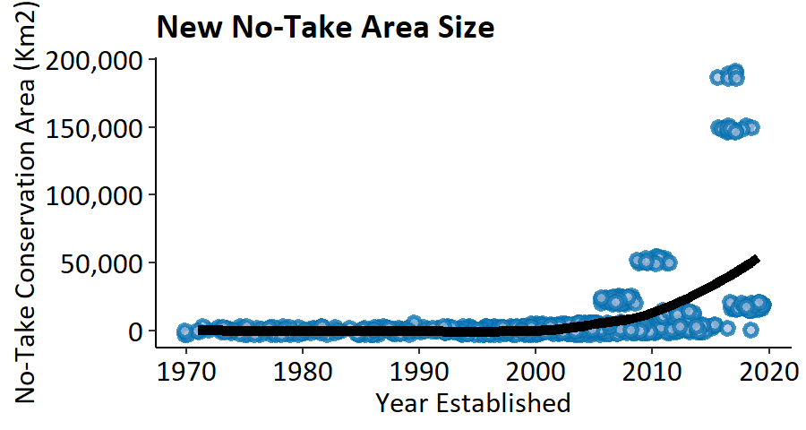

--- 
title: Cultural Evolution of Conservation Behavior at the Intersection of Working
  Landscapes and Protected Areas
author: "Matt Clark"
date: "`r Sys.Date()`"
output:
  bookdown::pdf_document2:
    toc: yes
  pdf_document:
    toc: yes
    extra_dependencies: "subfig"
  bookdown::html_document2:
    toc: yes
fontsize: 12pt
link-citations: yes
csl: AmJBot.csl
subtitle: Dissertation Proposal for Committee Review
bibliography: [References/Dissertationproposal.bib,References/NonZoteroRefs.bib]
---
```{r packages, include=FALSE, cache=FALSE, message=FALSE, warning=FALSE}
library(knitr)
library(rmarkdown)
library(bookdown)
library(formattable)
library(kableExtra)
library(dplyr)
library(magrittr)
library(prettydoc)
library(htmltools)
library(knitcitations)
library(devtools)
library(tidyverse)
library(scales)
library(extrafont)

```

```{r setup, include=FALSE, cache=TRUE, message = FALSE, warning=FALSE}
# Chunk options: see http://yihui.name/knitr/options/ ###

## Text results
#opts_chunk$set(echo = TRUE, warning = TRUE, message = TRUE, include = TRUE)

## Code decoration
#opts_chunk$set(tidy = TRUE, tidy.opts = list(blank = FALSE, width.cutoff = 60), highlight = TRUE)

## Caching code
knitr::opts_chunk$set(cache = 2, cache.path = "Cache/")

## Plots
#opts_chunk$set(fig.path = "Figures_MS/", dev=c('pdf', 'png'), dpi = 300)

## Locate figures as close as possible to requested position (=code)
knitr::opts_chunk$set(fig.pos = 'H')
```

# Summary
Area-based conservation is critical for stemming global biodiversity loss. As such, each year billions of dollars are spent to protect key areas. It is common however, for these areas to fail to reach their stated conservation goals. The most chronic causes of conservation project failure are the human dimensions. Conversely, historic conservation successes are also attributed to widespread human adoption of conservation behaviors. Research examining how and why conservation practices are adopted has been quite limited; suffering from a bias toward the reporting of successful projects and highly context dependent drivers and outcomes. This dissertation seeks to demonstrate and better understand the underlying mechanisms which underpin social adoption of conservation practices in and around protected areas. Toward this aim, this project will combine insights from cultural group selection theory with empirical research on Pemba Island, Tanzania to achieve three primary objectives. 

1. Develop a dynamic model to generate predictions regarding if and how conservation norms can emerge and persist via competition between groups.
2. Empirically test theoretical predictions of group conservation adoption as a function of group competition and individual costs and benefits. 
3. Using the ongoing spread of an improved efficiency cookstove design, specifically examine how the nature of interpersonal relationships may modify conservation behaviors as they spread within groups. 

Globally, we have expended a tremendous amount of resources to identify conservation goals which will deliver the greatest benefits to biodiversity and ecosystem function. For these benefits to come to fruition however, conservation initiatives must be adopted at a rate which exceeds ecological degradation. This research will bring together cultural evolutionary science and ecology to identify the key mechanisms of conservation adoption.  


# Introduction
## Phenomenon
Human prosperity is unequivocally linked to the persistence of diverse, self-sustaining ecosystems through our dependence on ecosystem services and consumption of renewable resources. Until approximately 50 years ago, the rate of overall ecological regeneration exceeded our rates of consumption and destruction of earth’s renewable resources [@network2019global]. Today, on average, we degenerate these resources at a rate 56% faster than regeneration [@network2020global]. This is particularly concerning as renewable resources regenerate at a rate proportional to the resource stock remaining [@beltratti_sustainable_1993]. Thus, overuse of earth’s renewable resources creates a positive feedback loop where scarcity slows regeneration and further perpetuates scarcity [@regev_biological_1998]. 

The capacity of an ecosystem to provision renewable resources largely hinges on an area’s biodiversity [@haines2010links; @redford1995human]. As such, biodiversity is the key metric used to determine the integrity of an ecosystem and a key conservation target [@parrish_are_2003]. Each year, an ever growing proportion of earth’s marine and terrestrial areas are sectioned off to protect local biodiversity (hotspots), the flow of genetic diversity across a landscape (corridors), and human access to renewable resources (forest concessions, fisheries, etc.) (Figure \@ref(fig:paNumber)) [@iucn2020protectedplanet]. These area-based conservation initiatives are from hereon referred to as protected areas. 

```{r paNumber, echo=FALSE, fig.cap="Number of newly established  no-take protected areas reported by the IUCN 2020", out.width = "100%", fig.align='center', dpi=72, fig.pos= "H"}
knitr::include_graphics("Figures/Ch1/Number.png")
```

Protected areas have proven to be a powerful tool for sustaining biodiversity and ecosystem function at a landscape scale while also ensuring continued access to renewable resources for local human populations [@adams_biodiversity_2004; @leverington_global_2010]. While high-profile protected area successes are salient in the conservation narrative, these areas also commonly fail to reach their intended biodiversity targets. The ubiquity of these failures is highly speculative as unsuccessful protected area initiatives go largely unreported [@bottrill_pursuit_2011; @sutherland_need_2004]. Despite a high degree of uncertainty in the prevalence of protected area failures, the cause is more often than not a lack of social buy-in and adherence to protected area regulations [@catalano_learning_2019]. 

Community adoption of protected area regulations may emerge and persist as a group norm, emerge only for a short period of time, or may never emerge within a given group [@rogers_diffusion_2010; @simon_win-win_2012]. These behaviors are characterized as individually costly, yet beneficial at the group level. Given that the human dimensions are most often the crux of successful conservation, the field of conservation social science has been developed to better understand which social factors are pertinent to conservation success [@bennett_conservation_2017]. This body of work has shown that where group norms around the adoption of protected areas have emerged, they persist via group conformity, especially where clear group identities are present [@ostrom_governing_1990; @richerson2001evolution]. What is less understood however, is the emergence and initial adoption of conservation behaviors. 

Research on the diffusion of conservation behaviors suffers from a lack of generalizability. Case studies tend to be highly context dependent and offer little mechanistic insight into the emergence and spread of these behaviors. Excitingly, parallel to the development of conservation social science, the field of evolutionary anthropology has developed the theory of cultural group selection as a mechanistic explanation for the adoption of individually costly, group beneficial behaviors. 

## Primer on cultural group selection
The largely untested theory of cultural group selection poses a mechanism for the emergence and spread of individually costly yet group beneficial behaviors such as warfare or religious donations [@boyd_transmission_2010]. Cultural group selection suggests that groups who develop individually costly yet group beneficial norms will outcompete groups who do not. As an individual’s behavior is flexible, individuals will either migrate from less to more successful groups or directly copy the cooperative behavior of others in visibly successful cooperative groups [@henrich_cultural_2004]. This change in the frequency of behavioral traits is analogous to the perpetuation of beneficial alleles in genetic natural selection. In these contexts, selective pressures still push individuals towards selfish behaviors like freeriding, but cooperative norms will emerge if group selection pressures outweigh those of individual selection overall [@mcelreath_mathematical_2008; @okasha_multilevel_2004; @price1972extension]. 

Existing cultural group selection theory is highly abstract, relying on simple, analytical models of nonspecific behaviors [@boyd_rapid_2011; @lehmann_cultural_2008]. Current theory therefore does not offer predictions about the emergence and adoption of conservation norms specifically. Conservation behaviors are fundamentally different from generic cooperative behaviors as they operate under the sink/source dynamics of renewable, mobile resources as well as variable resource regeneration rates. As such, cultural group selection theory must be extended to include these dynamics in order to be effectively applied to conservation. 

Applying cultural group selection to the adoption of conservation behaviors
Protected areas are an ideal microcosm for studying and applying cultural group selection. Protected areas have the potential to support resource sustainability and local livelihoods at the group level, but require costly cooperation from individuals [@adams_biodiversity_2004]. While this tradeoff is straightforward in theory, the social and ecological outcomes of protected area establishment vary significantly in practice [@naughton-treves_role_2005]. Agrawal and Redford [-@agrawal2006poverty] argue that this is because protected areas are often created as “a shot in the dark,” with little attention paid to the mechanisms which cause protected areas to be widely adopted and subsequently successful. Under cultural group selection theory, we expect that the key mechanism which drives the adoption of protected areas is the balance between the individual and group level selection pressures for cooperation or defection. Therefore, not only do protected areas represent a system where cultural group selection theory can be studied empirically, but principles of cultural group selection may also provide a way forward for predicting and shaping the success of protected areas on the ground. 

## Fidelity of behavioral transmission
The final component of behavioral adoption that is necessary to understand and shape effective conservation is the fidelity of behavioral transmission. In situations where behaviors do emerge and spread within a population, as the behavior is transmitted along the chain of individuals, it may be modified considerably to the point where the behavioral outcome is unrecognizable [@lewis_transmission_2012; @mcguigan_over-imitation_2011]. This phenomenon is of particular interest to conservation science where the outcomes of behavioral adoption are of greater interest than the behaviors themselves. Theoretical insights and controlled empirical research on transmission fidelity suggests that behavioral outcomes are more likely to be retained during transmission when the copying individual has greater access to the demonstrator [@king2007use; @muthukrishna_when_2016]. These insights are crucial for practitioners aiming to implement long-lasting, effective conservation projects, but must first be tested empirically in a conservation context where an individual’s access to a behavioral demonstration is realistic and outcomes of adopted behaviors have real impacts for individuals, communities, and the environment.

## Dissertation objectives
The overarching question this research seeks to answer is: What are the underlying social mechanisms which cause conservation behaviors to emerge and spread efficiently within populations?
 
* Objective 1: Create a dynamic, agent-based model which extends theories of cultural group selection into the contexts of conservation. Formally test the intuition that between group imitation can lead to the spread of community wide protected area adoption whereas solitary groups may fail to cooperate under identical environmental constraints such as resource degradation, regeneration, and mobility.

* Objective 2: Calculate theoretical adoption probabilities of protected areas known as Community Forest Management Agreements (CoFMAs) for each ward on Pemba Island, Tanzania. Probabilities are based on the salience of group cultural identities and the costs and benefits of CoFMAs to individuals and groups. Compare theoretical predictions to the presence or absence of CoFMAs in reality. 

* Objective 3: Quantitatively examine how social and physical access to a behavioral demonstration during behavioral transmission affects both the copying fidelity as well as the performance of copied behavior. This project will make use of the ongoing spread of fuel efficient cookstove technology on Pemba Island, Tanzania.

# Chapter 1: Theoretical Advances for Applying Cultural Group Selection Theory to Area-Based Conservation. 
## Background
Over the last 20-30 years, both the number and size of new no-take protected areas created each year have increased steadily (Figures \@ref(fig:paNumber) & \@ref(fig:paSize)) [@iucn2020protectedplanet]. During this time period, the stated mission of most protected areas has shifted as well. Due to the overlap between biodiversity and low income populations, as well as the price and availability of land, protected areas are largely adjacent to, or even contain, low income communities [@fisher_poverty_2007; @naughton-treves_role_2005]. With this recognition, their objectives now commonly include community development goals alongside conservation targets. 

```{r paSize, echo=FALSE, fig.cap="Size of newly established no-take protected areas reported by the IUCN 2020", out.width = "100%", fig.align='center', dpi=72, fig.pos= "H"}

```

Joint conservation and community development initiatives are a popular prescription for combating climate change and global biodiversity loss [@tallis_ecosystem_2008]. These dual-objective projects attempt to mitigate concerns of environmental neocolonialism and resource disenfranchisement of local populations [@hall_tourism_2004; @langholz_perils_2001]. Importantly, protected areas which explicitly seek to bolster the livelihoods of local populations actually show greater conservation success than those that do not [@fisher_poverty_2007]. Protected areas then represent a considerable opportunity for “win-win” projects which support global conservation and poverty alleviation [@adams_biodiversity_2004]. 
  
Protected areas, while well intentioned, often fail to meet both their stated social and ecological goals [@christie_marine_2004; @watson_performance_2014]. In fact, a study of protected areas in South Asia found them to be ecologically equivalent to adjacent unprotected lands [@clark_protected_2013]. It’s unsurprising that the success of protected areas in reaching both social and ecological targets has been linked to the degree of local support and adherence to regulations [@bennett_why_2014; @christie_observed_2005]. 

The degree of local buy-in for protected areas is not random. The scale of implementation is highly correlated with the percentage of individuals who adopt protected area regulations. A 2019 study demonstrated that nationally implemented initiatives had 84-100% buy-in from local populations, while locally established areas saw adoption from 0.13 - 51% of potential adopters [@mills_how_2019]. These findings are particularly worrying given a global decline in government support for land conservation [@watson_performance_2014]. 

With the recognition that local adoption is a difficult and necessary component of conservation success, human dimensions have become a major focus of conservation research [@bennett_conservation_2017]. This body of work has largely relied on case studies of conservation projects to draw correlations between social phenomena and conservation outcomes. As such, findings from conservation social science tend to offer little mechanistic insights for how conservation behaviors spread within and between groups. Recently however, theories from cultural group selection have been identified as a potentially useful tool to better elucidate the mechanisms which underpin local buy-in for conservation initiatives [@brooks_applying_2018].
  

Cultural group selection theorizes that individuals will adopt behaviors which adhere to protected area regulations if the group benefits of doing so allow their cultural group to outcompete other groups [@rindos_darwinian_1985]. Under this framework, multiple competing groups are actually required for community adoption of protected area regulations to emerge [@richerson_cultural_2016]. 

While the theory and principles of cultural group selection are relatively well established, they are yet to be tested mechanistically in the context of protected area adoption. With this in mind, this project aims to demonstrate how the presence of multiple competing groups can facilitate the adoption of adherence to protected areas. In this chapter I will develop a dynamic, agent-based model to test the logic of how protected area norms can emerge under very simple sets of rules in the presence of multiple competing groups, but fail to emerge for solitary groups under identical environmental contexts. 

### Question:
Can between group competition provoke protected area adoption where solitary groups may fail to adopt? 

### Predictions:
* P1: Adoption of protected area adherence will only emerge under the presence of multiple competing groups. 

* P2: Where it already exists, protected area adherence will perpetuate in populations even in solitary groups given group conformity.

* P3: Greater degrees of resource mobility will increase the frequency in which the adoption of protected area adherence emerges in the community(ies).

## Research Design 

An agent-based modeling framework is ideal for demonstrating the theory of cultural group selection regarding protected area norms, because it allows such group level properties to emerge out of simple decision rules for each individual (Railsback & Grimm, 2012; Wilensky & Rand, 2015). This design mirrors our real-world understanding of the important system components.

### Model Description

```{r conceptDiagram, echo=FALSE, fig.cap="Concept diagram of agent-based model scheduling under single group dynamics", out.width = "100%", fig.align='center', dpi=72, fig.pos= "H"}

```

## Preliminary Work

```{r abmOutput, echo=FALSE, fig.cap="Fifteen example runs of the current, single-group agent based model", out.width = "100%", fig.align='center', dpi=72, fig.pos= "H"}

```

## Expected Products
I plan to communicate the findings of this project both to the academic community and to non-scientists. The insights gained from this model will be published in a peer reviewed, academic journal such as Environmental Modeling and Software. This paper will show logically how we expect that protected areas function in the context of community level cooperative conservation. An example of how this model may inform implementation of protected areas for various resource mobilities or starting resource degradation is displayed in figure (XXX).

To make this model readily available to a general audience however, I will update the online application provided above to better reflect the final version of the model. In this application I will also embed a graphical display of the model function as a .gif that displays key outputs at each timestep of the model. This will allow users to better internalize the implications of the model and to better apply them to real world conservation. 


# Chapter 2: Effects of inter-group resource competition and selection on community adoption of costly conservation policy. 

## Background
Cultural group selection offers specific predictions about when individually costly, yet group beneficial norms will be favored by selection [@molleman_cultural_2013]. One such prediction is that the presence of multiple competing groups is the key to the development of norms for sustainable resource use [@waring_coevolution_2017]. Under this prediction, selection acts both on individuals and on groups of individuals. When the ratio of group benefit to individual cost of cooperation outweighs the individual fitness consequences of cooperation, those behaviors will be favored by selection. Groups who develop cooperative norms around natural resource use will outcompete other groups, who may then copy the cooperative institutions established by the more successful groups [@boyd_transmission_2010; @henrich_cultural_2004]. 

While these predictions are theoretically sound, they must be tested empirically. Two such studies have begun to test the basis of cultural group selection in the natural world. The first demonstrated that culture offers greater fodder for group selection than do genetics. Researchers estimated the total variance in both cultural and genetic traits within and between groups of individuals. The proportion of variance in an allele or trait found between groups is referred to as genetic Fst or cultural Fst respectively. Findings indicate that between human groups, there is greater differentiation in culture than genes, indicating that group selection will act more readily on cultural traits [@bell_culture_2009]. 

A second empirical study tested the prediction that large scale human cooperation is in fact a product of competition between cultural groups. Researchers created pair-wise estimates of cultural Fst between 12 ethnic groups. These estimates of cultural differentiation were combined with a survey of individual willingness to cooperate with members of the other groups. Results of this study showed a strong association between cultural similarity and willingness to cooperate. This research indicates that the presence of variable cultural groups influences within-group cooperative behavior [@handley_human_2020].

This project aims to extend the empirical study of cultural group selection to cooperation around environmental problems explicitly. Given the theoretical capacity for cultural group selection to provide solutions to pressing environmental issues of collective action, these predictions must be validated experimentally so that they might be implemented effectively. 

Conservation via protected areas represents an ideal study system for testing the environmental applications of cultural group selection in the real world. Ignoring the regional to global scale ecosystem service benefits of protected areas, the units of the individual costs and group benefits of protected area adoption are directly comparable (i.e. fuelwood growth/use). This comparability will allow us to use established methods of measuring multilevel selection pressures to quantitatively predict if protected areas are likely to be selected for in each group. Finally, this project will compare the calculated selection pressures for protected area adoption from each group against the observed adoption of community managed protected areas.


## Research Design

## Preliminary Work
This project benefits from preliminary work done by our collaborators at the Max Planck Institute for Evolutionary Anthropology (MPI). MPI researchers conducted a preliminary qualitative survey and coalition of oral histories with the assistance of Department of Forestry staff to confirm anecdotally that competition between wards has led to CoFMA adoption at the ward level. These researchers have also visited wards across the island and recorded which wards have adopted CoFMAs and which have not. These adoption characteristics will be compared against the adoption characteristics recorded in my work as a form of data validation.

## Expected Outputs
The primary outputs of data collection and analysis in this project will produce binary predictions of protected area adoption for each study ward, as well as the calculated strength of selection for protected area adoption for each study ward. I will compare these calculated adoption likelihoods and selection strengths against actual adoption rates of community managed protected areas. (Figure \@ref(fig:selPress)) shows an example of what the results of this study might look like. The findings of this study will be submitted for publication in a peer reviewed, academic journal. 


```{r selPress, echo=FALSE, fig.cap="Simulated data showing protected area adoption vs calculated selection pressure for group adoption of protected areas.", out.width = "100%", fig.align='center', dpi=72, fig.pos= "H"}

```

# Chapter 3: Social influences on transmission fidelity in household level diffusion of beneficial technology.

## Background
Forests sequester 2 billion tons of atmospheric CO2 each year, while also providing fuel to 40% of the world’s rural poor — fuelwood produces more renewable energy than solar, wind, and hydroelectric sources combined [@muller2018state]. Household fuel production and global carbon sequestration are often seen as conflicting forest benefits. Solutions to mitigate this tradeoff include expanding markets for non-timber forest products and technological advances like solar panels [@mcshane_hard_2011]. Given limited funding, these projects are not intended to solve problems in their entirety, but rather to seed innovations that catalyze broad change. Many of these initiatives, however, fail to spread and produce long-term benefits for local livelihoods or forest conservation because they do not account for underlying social dynamics [@keppel_conservation_2012; @oates_myth_1999; @stringer_land_2007].  

This project will examine the spread of fuel-efficient cookstoves on Pemba Island, Tanzania (see Figure \@ref(fig:stovePic)). An improved stove design which increases fuel efficiency by up to 50%, was seeded in three communities on the island in 2015 [@lung_large-scale_2019; @sakthivadivel2018experimental]. The improved design has been subsequently copied throughout the communities and is thought to reduce deforestation and the time individuals — primarily women and children — must spend harvesting fuelwood.

```{r stovePic, echo=FALSE, fig.cap="Example of an improved, fuel efficient cookstove on Pemba Island, Tanzania. Image from Same Mwanga Environmental Conservation Advisory Organization", out.width = "100%", fig.align='center', dpi=72, fig.pos= "H"}

```

While this project will inform effective implementation of household level conservation projects on the ground, it will also provide important insights for understanding behavioral adoption more generally. While the ubiquity and utility of behavioral imitation, or copying, is well documented, the fidelity of behavioral imitation varies circumstantially [@lyons_hidden_2007; @mcguigan_over-imitation_2011]. In a foundational study, researchers show that learned behavior is reconstructed and assimilated with an individual’s prior experiences, rather than replicated directly [@bartlett1932remembering]. Behavioral reconstruction creates variation in copied behaviors [@horner_faithful_2006]. Replication variation is thought to be greatly influenced by environmental factors, including social context [@mesoudi_multiple_2008]. 

Both theoretical and experimental studies have examined the relationship between transmission fidelity and environmental influences. Theoretical work suggests that increasing transmission fidelity should be associated with greater reliance on social learning [@boyd_modeling_2002; @nakahashi_adaptive_2012]. This theory has also been validated experimentally [@muthukrishna_when_2016]. When coupled with the theoretical prediction that social learning should increase with greater access to behavioral demonstrators, it follows logically that transmission fidelity should increase with imitator access to the behavioral model [@king_when_2007].

While transmission fidelity can vary significantly given the context, it is often unclear what effect this variation has on the outcomes of imitated behavior. Theoretical models have shown that even small changes in transmission fidelity can have strong impacts on population-level behavioral outcomes [@lewis_transmission_2012]. Alternatively, some behaviors require only very low-fidelity replication to achieve identical outcomes [@enquist_one_2010]. In fact, it is likely that if a behavior is under strong environmental constraints then individual learning should help correct errors in the transmission process.   

Currently, we do not yet understand how various forms of access to behavioral demonstration may affect transmission fidelity. Secondly, relatively little empirical research has examined the relationship between transmission fidelity and behavioral outcomes [@mesoudi_multiple_2008]. This research will directly measure the impact of geographic, genetic, and social relatedness on the fidelity of copying behavior, and the impact of transmission fidelity on specific behavioral outcomes.

In summary, conserving forest cover is critical for the global carbon balance and for the well-being of many rural communities. Conservation projects often fail due to a lack of consideration of the social processes underlying adoption. With few studies that measure transmission fidelity in a naturalistic setting, where outcomes have real economic and health impacts - we have an opportunity to explore how environmental constraints and social learning interact when outcomes matter. This project seeks to further investigate how and why behaviors are modified during the transmission process and how modification (both enrounious and intentional) affect performance targets. 

### Question
What effect do geographic distance, genetic relatedness, and social relatedness have on transmission fidelity? Secondly, what is the relationship between transmission fidelity and behavioral outcomes?

### Predictions
* P1: Using geographic distance, genetic relatedness, and social network distance as proxies for access to behavioral demonstrators, we expect transmission fidelity to increase with increasing access.

* P2: As access to behavioral demonstration decreases, we expect to see differential changes in the fidelity of replicated behavior and the behavioral performance target of interest.

* P3: Given the high degree of environmental influence on a behavior, we expect to observe a greater change in the fidelity of transmission than in the behavioral performance target, correlative with decreasing access to behavioral demonstrators.   

## Research Design

### Approach
This project will take advantage of an ongoing initiative to spread fuel-efficient cookstoves on Pemba Island, Tanzania. This initiative has funded the building of a small number of improved cookstoves across communities which have subsequently been voluntarily copied by other community members. To answer the research questions above, I will collect data on the visual similarity of all copied cookstoves and the models they were copied from to assess direct transmission fidelity. I will also measure the fuel efficiency of the cookstoves as the behavioral outcomes of interest.  

### Methodological Specifics
I will map all the seeded and voluntarily copied fuel-efficient cookstoves in Makangale, Msituu mkuu, and Kifundi wards on Pemba Island, Tanzania (Fig \@ref(fig:mapp)). With the assistance of a translator, I will survey all the individuals responsible for constructing each cookstove, measure a suite of physical characteristics of each cookstove (length, height, etc.), and measure the fuel efficiency. 

```{r mapp, echo=FALSE, fig.cap="Satellite map of Pemba Island, Tanzania. Three marked locations are the wards which will be surveyed for fuel-efficient cookstove copying fidelity and outcomes.", out.width = "100%", fig.align='center', dpi=72, fig.pos= "H"}

```

The survey instrument used for this research will elicit information regarding the relationship between the builder of each cookstove and the individual they copied their stove design from. Specifically, this survey tool will be used to gather data on geographic distance, genetic relatedness, and social relatedness. I will also use this survey to collect data on the decision making processes individuals exhibit when deciding to build a fuel-efficient cookstove. 

While conducting the fuel efficiency test, I will also measure a variety of physical stove characteristics such as the exterior dimensions and size of the openings. I will use these measures to produce quantitative estimates of how physically similar each cookstove is to the cookstove it was copied from. To measure stove fuel efficiency, I will follow the standard water boiling test protocol [@defoort2009stove; @mccracken1998emissions]. Water temperature will be measured in standard intervals and compared against the weight of fuel-wood before and the weight of fuel-wood and charcoal remaining at the end of the test. 

The key research questions for this project will be assessed using multilevel regression operationalized in a Bayesian context. I will compare standardized parameter estimates, to determine which factors (genetic relatedness, geographic distance, social relatedness) most strongly contribute to copying fidelity in this study system. Similar analyses will be used to determine which factors affect cookstove primary outcome variables (fuel efficiency and particulate matter production).  

This project will contribute to scientific reproducibility in multiple ways. First, this work will be preregistered with the Open Science Framework. To confirm the analytical plan in advance of preregistration, I will fit the statistical models proposed above to simulated data and verify that the models recover the parameters known to have been generated in the simulated data. Secondarily, once all data for this project has been collected and the analyses are complete, all non-confidential data and R code used for this project will be made publically available through a GitHub repository shared by all team members.


## Preliminary Work
In preparation for a cancelled field season in the Summer of 2020, I created a variety of forms and documents to facilitate data collection. These include:

* A household livelihood and stove adoption survey.

* A datasheet for cookstove fuel efficiency measurements.

* A fuel efficiency measurement protocol. 

I also simulated data that matches the data would be collected by the multiple instruments. These data were used to test the ability of my proposed statistical methods to recover the signal of demonstrator access on behavioral transmission fidelity and behavioral outcomes. 


## Expected Outputs
The regression outcomes from this analysis will be the primary result presented in the publication of this research. Figures  \@ref(fig:csp1) and  \@ref(fig:csp2) show significant and insignificant theoretical outcomes that we might observe. The findings from this paper will also be shared broadly as a white paper describing how the insights from this research can help shape future conservation and development initiatives which distribute fuel efficient cookstoves in rural areas. 

```{r csp1, echo=FALSE, fig.cap="Simulated outputs showing a possible relationship between stove copying fidelity and weekly communication between the demonstrator and copier", out.width = "100%", fig.align='center', dpi=72, fig.pos= "H"}

```


```{r csp2, echo=FALSE, fig.cap="Simulated outputs showing a possible relationship between stove copying fidelity and geographic distance between the demonstrator and copier", out.width = "100%", fig.align='center', dpi=72, fig.pos= "H"}

```
# Conclusion


# References


