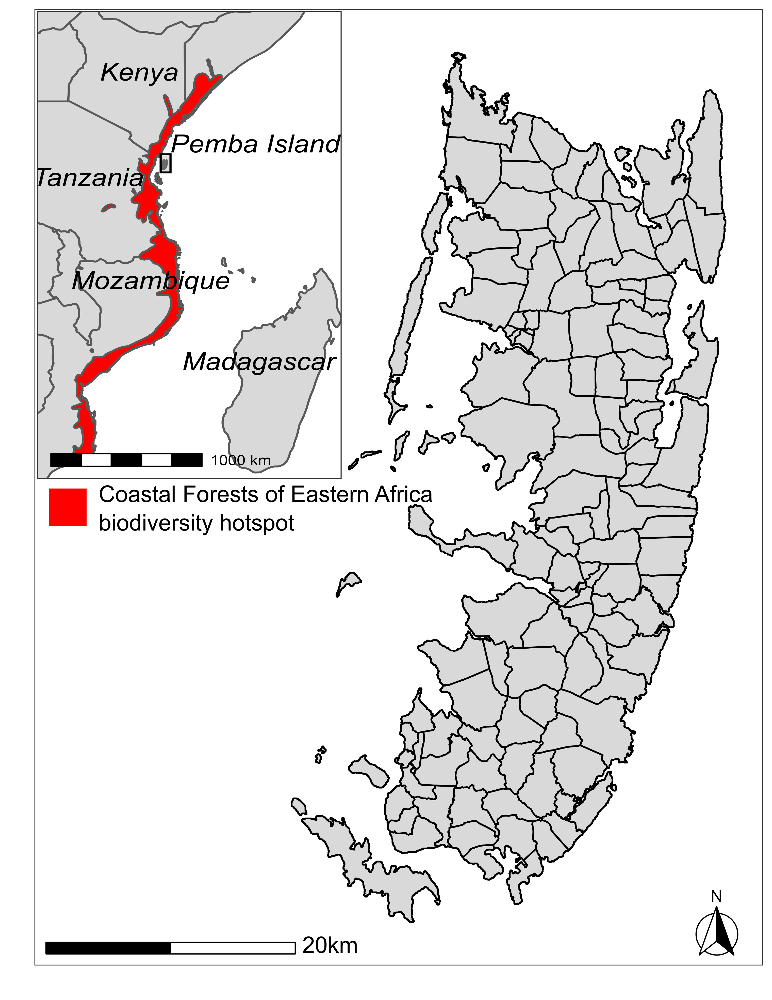
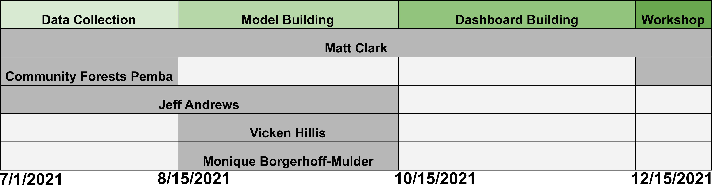

```{r packages, include=FALSE, cache=FALSE, message=FALSE, warning=FALSE}
library(knitr)
library(rmarkdown)
library(bookdown)
library(formattable)
library(kableExtra)
library(dplyr)
library(magrittr)
library(prettydoc)
library(htmltools)
library(knitcitations)
library(devtools)
library(tidyverse)
library(scales)
library(extrafont)
```

```{r setup, include=FALSE, cache=TRUE, message = FALSE, warning=FALSE}
knitr::opts_chunk$set(cache = 2, cache.path = "Cache/")

## Plots
#opts_chunk$set(fig.path = "Figures_MS/", dev=c('pdf', 'png'), dpi = 300)

## Locate figures as close as possible to requested position (=code)
knitr::opts_chunk$set(fig.pos = 'H')
```


\newpage

# Executive Summary
From 2001–2019, the world lost 9.7% of total tree cover, largely due to deforestation. These losses directly reduce ecosystem and human resilience to climate change. Despite decades of effort into international and community-based conservation, preventing deforestation is still a critical problem. Conservation projects that work in one place are abandoned in others, or worse, have adverse impacts on local communities. Much of the literature around deforestation has focused either on the relevant ecological processes or social processes in isolation. This project will explicitly study the feedbacks between social and ecological processes in the context of conservation interventions. Thus, our project aims to understand how features of the natural system interact with features of the social system to create conservation outcomes.

Our research integrates both empirical data collection and theoretical land use simulations of our study system, Pemba Island, Tanzania. Because of the variation in natural features, as well as the fact that Pemba has been host to a variety of both international and community-based conservation interventions, the island serves as an ideal place to assess the factors driving conservation success. To ensure that our research produces findings that help local communities in Pemba combat deforestation, we are collaborating with Community Forests Pemba, a nonprofit organization focused on climate resilience through sustainable agroforestry.

Results of this project will significantly improve our ability to predict conservation outcomes for both the environment and communities. To communicate simulation outcomes, we will produce an interactive dashboard displaying alternative conservation scenarios. We will host a workshop with our community partner to demonstrate how project results can inform ongoing conservation efforts. This work advances the HCRI Natural Environment pillar by providing a roadmap for conservation planning in Pemba and in complex social-ecological landscapes broadly. This work also contributes to the Economy & Society pillar by explicitly demonstrating the local economic viability of intervention strategies.


\newpage

# Project Team

\newpage
# Project Narrative
### Background and Rationale
Diverse and intact natural landscapes are unequivocally our best insurance policy against the worsening impacts of climate change [@isbell2015biodiversity; @loreau2001biodiversity; @oliver2015biodiversity; @lloret2012extreme; @alongi2008mangrove]. In response, $24 billion is spent on conservation interventions annually [@waldron2020protecting; @waldron2017reductions]. As the world’s most biodiverse areas greatly overlap with the world’s poorest communities, many conservation interventions require community development and buy-in from vulnerable, often indenous populations [@fisher2007poverty; @mittermeier2011global; @larsen2012conserving; @naughton2005role]. 

\begin{wrapfigure}{r}{0.5\textwidth}
  \begin{center}
    \includegraphics[width=0.48\textwidth]{InsetSimple.png}
  \end{center}
  \caption{Pemba Island, Tanzania. Black lines show geographic boundaries for 121 distinct wards on the island. Subfigure shows East Africa with the Coastal Forests of Eastern Africa biodiversity hotspot highlighted in red.}
\end{wrapfigure}

Conservation interventions, while well intentioned, frequently fail to meet both ecological and community development goals [@christie_marine_2004; @watson_performance_2014]. When environments and livelihoods are closely linked, economic and ecological processes may have complex interactions and feedbacks that make conservation outcomes difficult to predict. One area in particular, the Coastal Forests of Eastern Africa biodiversity hotspot, has seen considerable foreign and community-based investment in conservation, yet deforestation and biodiversity loss in the area continue to worsen [ @burgess2017two; @cuadros2018empty]. 

This study focuses on Pemba Island, Tanzania, located in the Coastal Forests of Eastern Africa biodiversity hotspot. Deforestation is a perennial issue in Pemba, as the yearly deforestation rate is nearly 2%, and 90% of households rely exclusively on forest products (fuelwood and charcoal) to meet their daily cooking needs [@RGZ2014Zanzibar; @ely2000participatory]. As such, Pemba has been subject to a stream of foreign conservation initiatives since the mid 20th century, yet deforestation remains apace. Unfortunately, anecdotal evidence suggests that resentment is mounting amongst residents towards the train of conservation projects that have failed to deliver any sustained economic compensation or ecological benefits. Our collaborative effort will build land use simulations that integrate ecology and economics to demonstrate why conservation and development initiatives have continued to fall short in Pemba, and how we can do better in the future.

This project is in collaboration with the Max Planck Institute for Evolutionary Anthropology, and Community Forests Pemba, a Pemban nonprofit organization established in 2009 with a mission to conserve and restore Pemba’s forests while supporting livelihood development on the island. The organization specifically seeks to build a resilient Pemba, ecologically and economically, with respect to climate change. This effort is mutually beneficial as Community Forests Pemba facilitate data collection and provide on-the-ground logistical support, while resulting land use simulations will inform future conservation efforts by the organization 

If funded, the project will establish a formal collaboration between the Hazards and Climate Resilience Center, the Max Planck Institute for Evolutionary Anthropology, Community Forests Pemba, and Boise State Human-Environment Systems. This funding will specifically support the dissertation work of one PhD student at Boise State, Matt Clark, and will yield an interactive web dashboard displaying all land use simulations described below. 

```{r Mapp, echo=FALSE,eval=FALSE, fig.cap="Pemba Island, Tanzania. Black lines show geographic boundaries for 121 distinct wards on the island. Subfigure shows East Africa with the Coastal Forests of Eastern Africa biodiversity hotspot highlighted in red.", out.width = "40%" ,fig.align='center', dpi=72, fig.pos= "H"}

```

### Aims and Objectives
Our project will generate predictions for ecological and economic viability of two common conservation interventions: protected areas and payments for ecosystem services (Table \@ref(tab:tabinterventions), and provide a roadmap for implementing successful conservation projects on-the-ground.

We will produce two specific deliverables to immediately inform conservation efforts on-the-ground in Pemba.

1. We will create and host an interactive web dashboard to let individuals run our agent-based simulations to visualize alternative scenarios and better predict conservation outcomes. This web tool will accompany the scholarly publication of this work to better communicate findings to a broad audience. 

2. We will hold a community information and training session with Community Forests Pemba to communicate the findings and implications of this project and to give a live demonstration of the web dashboard described above. This session will be designed to immediately inform ongoing conservation efforts.

### Research Methods
*Data Collection*

Empirical data collected for this project will inform the decision rules built into our agent-based land use simulations. Our objective is to understand how individuals make decisions in response to varying ecological and economic conditions. To achieve this, our Community Forests Pemba will identify community members who have been subject to a variety of different conservation interventions and rely on each of the four forest types on the island: high tropical rainforest, mangroves, coral rag forest, and agroforestry scrub matrix. Only community members who actively rely on harvesting fuelwood for household needs will be interviewed. Respondents will be compensated for their time (see budget). 

With the help of a local translator arranged by Community Forests Pemba, Matt Clark and Dr. Jeff Andrews will conduct structured interviews with each of these community members. Interviews will consist of a series of scenarios where the respondent is asked how they would modify their wood harvesting strategy based on the environmental and economic conditions of interest.   

*Modeling*

Dr. Vicken Hillis and Dr. Monique Borgerhoff-Mulder will oversee the agent-based modeling portion of this project. All model coding will be done by Matt Clark. Our simulations will vary features of the natural environment including: dispersal distance, market substitutability, regrowth rate, and starting degradation. We will then impose three different conservation intervention scenarios and features within them, all listed in Table \@ref(tab:tabinterventions).  

Within this backdrop, individuals make harvesting decisions about where (protected or not) and how much fuelwood to harvest. Decision-making and learning rules are motivated by insights from cultural evolutionary theory. In particular, we’re interested in how intervention types affect individual’s access to resources given their environment, how individuals respond to these changes, and how community response further impacts their environment. 

All simulations will be displayed visually on an interactive dashboard created using the Flexdashboard and R Shiny functionality in the R statistical programming language [@R; @flexD; @shiny]. The dashboard will allow users to test all three intervention scenarios and their variations against all described social and ecological starting conditions. 


```{r tabinterventions, echo=F, fig.align='center', warning=FALSE}
intVars <- data.frame(Intervention = c("No intervention","Protected areas", "Payments for ecosystem services"), 
                      Scheme = c("Individuals harvest renewable resources at a rate which matches their household need, regardless of the location on the landscape or harvest rate compared to resource regeneration rate.",
                                 "Some portion of the landscape is designated for conservation and resources inside are socially unacceptable to harvest. Resource units produced inside conservation area may spillover to use area under sink/source dynamics. Some agents may defect and harvest from the conservation area.",
                                 "Agents are incentivised to forgo harvesting resources in return for economic payments. Payments may offset resource collection when agents previously sold harvested resources, but may fail to change incentive structures when agents directly depend on resources harvested."), 
                      Features = c("N/A",
                                      "Protected area size",
                                      "Market value for harvested fuelwood, Payment amount"))

kbl(intVars,format="latex", caption = "Three conservation intervention scenarios to be tested with the proposed agent-based model.",escape=F,booktabs = T) %>% 
  kableExtra::kable_styling(latex_options = c("striped","hold_position"), font_size = 9)%>%
  #kable_classic_2(full_width=T)%>% 
row_spec(0,bold=TRUE)%>%
    column_spec(1, width = "8em")%>%
    column_spec(2, width = "25em")%>%
  column_spec(3, width = "8em")
  
  

```


### Key Implications
*Intellectual Merit*

Predicting if and how conservation actions will evolve has proven to be a major challenge for conservation scientists and practitioners [@child2010conceptual]. Conservation social science largely relies on case studies to draw correlations between social phenomena and conservation outcomes. Widely applicable theory around the long-term adoption of conservation norms is therefore sparse [@mahajan2020theory]. Recently however, theories from cultural evolution, a field of anthropology, have been identified as a potentially useful tool to better understand the mechanisms which drive the evolution of conservation initiatives [@brooks_applying_2018].

Cultural evolution offers theories on the mechanisms behind the evolution of cooperative behaviors such as adhering to community conservation. Existing cultural group selection theory however, is highly abstract, relying on simple, analytical models of nonspecific behaviors [@lehmann_evolution_2006; @boyd_rapid_2011]. Current theory therefore does not offer predictions about the evolution of conservation norms specifically [although see @waring2015multilevel; & -@waring_coevolution_2017]. This is problematic as conservation behaviors have behavior-environment feedbacks which are fundamentally different from generic cooperative behaviors. They operate under the sink/source dynamics of renewable, mobile resources as well as variable resource regeneration rates. Specific resources may also be substitutable for other goods on the market or communities may rely on them directly. As such, cultural group selection theory must be extended to include these dynamics in order to be effectively applied to conservation.

*Broader Impacts*

The broader impacts of this research will advance the overall mission of HCRI to build resilient communities by providing methodology and tools to better plan conservation projects for nature and communities as an integrated system, both in Pemba and elsewhere. The project as described also closely aligns with both the Natural Environment and Economy & Society HRCI pillars in the following ways:

* *Natural Environment* - The work here will provide immediately actionable insights for conservation in Pemba Island and Zanzibar overall. Our community partner, among others, will be provided with the tools to make use of these insights as part of ongoing conservation and community development efforts. More generally, conservation is in need of unifying theory about which kinds of interventions succeed or fail as a result of underlying ecological and social conditions. This research will serve as a foundational building block for conservation science to consider complete social-ecological landscapes moving forward. 

* *Economy & Society* - Fuelwood and charcoal are the primary source of energy to 40% of the world’s rural poor, producing more renewable energy than solar, wind, and hydroelectric sources combined [@muller2018state]. Conservation may be the key to ensuring continued access to vital resources for communities in an uncertain climatic future, but it may also backfire and disenfranchise communities to much needed resources. Similar to the pillar above, the work described here will be immediately relevant to better designing conservation projects in our study system, but the implications of the scholarly work are notably far-reaching. Our simulations will explicitly consider the access to resources of local communities both as an outcome and as a driver of conservation efficacy. 

### Dissemination Plan 
Scholarly results from this project that advance conservation science broadly will be published in a peer-reviewed academic journal. Currently we are targeting *Environmental Modeling and Software*. All model code will be posted on a public GitHub repository and linked to the publication. Before publication we will contribute to open, reproducible science by making our pre-print manuscripts available online using the preprint science repository arXiv.org. 

Pemba specific results and the web tool which will accompany this project will be presented at a workshop with Community Forests Pemba described earlier in this proposal. This workshop is currently planned as an online, remote workshop given budget restrictions and the covid-19 pandemic. If possible, we would like to host this workshop in-person if conditions change.

### Timeline 
```{r timeline2,echo=FALSE, cache=TRUE, message = FALSE, warning=FALSE,fig.cap="Timeline of proposed research activities and team members involved.", out.width = "80%", fig.align='center', dpi=72, fig.pos= "H" }


```

```{r timeline, eval=FALSE,echo=FALSE, cache=TRUE, message = FALSE, warning=FALSE} 
library(vistime)
library(ggplot2)

data <- read.csv(text="event,group,start,end,color
                       Data Collection,Phase,2021-07-01,2021-08-15,#ccece6
                       Model Building,Phase,2021-08-15,2021-12-15,#99d8c9
                       Workshop,Phase,2021-12-15,2021-12-31,#66c2a4
                       Matt Clark, Matt Clark,2021-07-01,2021-12-31,#bdbdbd
                       Community Forests Pemba, Community Forests Pemba,2021-07-01,2021-08-15,#bdbdbd
                         , Community Forests Pemba,2021-12-15,2021-12-31,#bdbdbd
                       Jeff Andrews, Jeff Andrews,2021-07-01,2021-12-31,#bdbdbd
                       Monique Borgerhoff-Mulder, Monique Borgerhoff-Mulder,2021-08-15,2021-12-15,#bdbdbd
                       Vicken Hillis, Vicken Hillis ,2021-08-15,2021-12-15,#bdbdbd"
                 
                       )


#vistime(data) 
#p<-gg_vistime(data, title = "Table 2: Timeline of proposed research activities and team members involved")
p <- gg_vistime(data, optimize_y = T, title = "Table 2: Timeline of proposed research activities (green) and\nteam members involved (grey).")


p +theme_bw()+scale_x_datetime(date_breaks = "1 month")+ ggplot2::theme(
  plot.title = element_text(hjust = 0, size=15, color="black"),
  axis.text.x = element_text(size = 8, color = "black"),
  axis.text.y = element_blank(),
  axis.ticks.y = element_blank(),
  panel.grid.major = element_blank(),
          panel.grid.minor = element_blank(), axis.line = element_line(colour = "black"))

```

### Future Directions
The Human-Environment Systems research center at Boise State has built a partnership with researchers at the Max Planck Institute for Evolutionary Anthropology already working on conservation research in Pemba Island, Tanzania. Although we consider our partnership to be strong, Boise State personnel have not yet visited the field site. If funded, this project will begin what we anticipate will be a long-lasting and fruitful research program. Thus, this proposal will not only fund necessary conservation research, but will also fund an international research partnership between both institutions. 

Future research will seek to collect quantitative data in our system to validate the outcomes of our land use simulations. These data will include biodiversity and land cover data from Pemban forests, as well as community metrics on exposure to conservation interventions and willingness to participate in future interventions.   

\newpage


\includepdf[pages={-}]{CURRICULUMVITAE.pdf}


\newpage

\includepdf[pages={-}]{CFP_Letter.pdf}

\newpage

# References